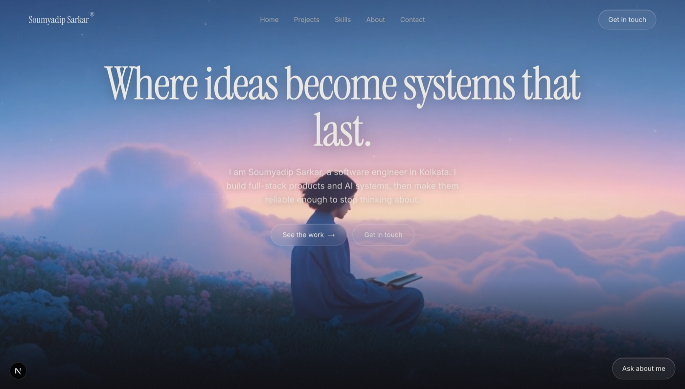
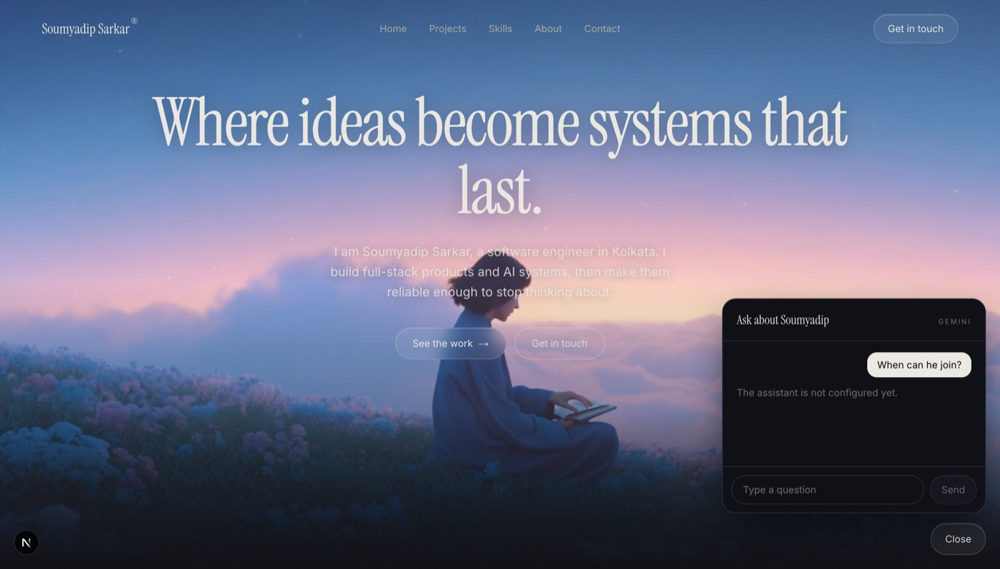

# Portfolio, with an assistant that knows the resume

Personal site for **Soumyadip Sarkar**, a software engineer in Kolkata. Built
with Next.js 15, React 19, Tailwind v4, Motion, and the Gemini API.



The interesting part is not the page. It is that a recruiter can ask it
questions.



---

## Quick start

```bash
npm install
cp .env.example .env.local     # paste a key from aistudio.google.com/apikey
npm run dev                    # http://localhost:3000
```

The site runs without a key. Only the assistant needs one, and it degrades to a
clear "not configured yet" message rather than breaking.

---

## Editing the site

**Everything you can read lives in [`app/content.ts`](app/content.ts).** One
file: every sentence, link, project card, number, and the assistant's knowledge.
`app/page.tsx` holds layout and contains no content of its own.

| I want to… | Do this |
|---|---|
| Change any wording | Edit the string in `content.ts` |
| Add a project card | Copy a block inside `projects`, paste, edit |
| Add a screenshot | Drop it in `public/`, reference it as `"/name.jpg"` |
| Use a gradient instead | Set `image: null` and pick a `fallbackTint` |
| Answer a recruiter question | Fill the matching field in section **9b** |

Adding a project updates the page **and** the assistant from that one edit,
because the assistant's briefing is generated from the same data rather than
written out a second time.

---

## The assistant

A floating widget answers questions about the resume: projects, stack,
education, availability, notice period, relocation, and where to get the CV.

It is built to be safe to point at a recruiter:

- **The API key never reaches the browser.** All calls go through
  `app/api/chat/route.ts` on the server.
- **It will not invent things.** Grounded on `content.ts` and instructed to
  defer to email for anything it does not know. Asked "Did he work at Google?",
  it separates the Google *certification* from employment instead of guessing.
- **It will not negotiate.** Salary questions return "open to discussion" and
  quote no number, by design.
- **Blank means silent.** Any field left `""` in section 9b is dropped from the
  briefing, so the assistant says "email him" rather than answering with
  nothing.
- **Guardrails:** 12 requests/min per IP, 10-message history cap, 1000-character
  messages, retry on upstream 503 only.

Model defaults to `gemini-3.5-flash-lite`. Override with `GEMINI_MODEL`.

---

## Notable decisions

- **No AI SDK.** Gemini's REST endpoint is a single `fetch`; a dependency would
  not have earned its weight.
- **`gemini-3.5-flash-lite` over `3.6-flash`.** The larger model gave slightly
  richer answers at ~4s a turn, but the free tier caps it at 20 requests per
  rolling window, which two simultaneous visitors can exhaust. The lite model
  answers in ~1s with far more headroom; the lost nuance was recovered in the
  prompt instead.
- **`maxOutputTokens: 1200`, not 300.** These are thinking models. At 300 the
  model spent ~285 tokens reasoning and 11 on the answer, truncating
  mid-sentence.
- **Retry on 503 only.** A 429 here is the quota asking for several seconds of
  backoff; retrying immediately just spends another unit.
- **Sticky-stack in CSS, not GSAP.** `position: sticky` does the same job,
  ships no library, and works with JavaScript disabled.

---

## Structure

| Path | Contents |
|---|---|
| `app/content.ts` | all site content, the only file you normally edit |
| `app/page.tsx` | section components, no content |
| `app/chat-widget.tsx` | assistant UI, link handling, loading and error states |
| `app/api/chat/route.ts` | Gemini proxy, prompt, rate limiting |
| `app/globals.css` | theme tokens, gradients, film grain |
| `public/` | hero video and project screenshots |

---

## Deploying

Set `GEMINI_API_KEY` in your host's environment settings, never in a committed
file. `.env*` is gitignored and the key has never been committed to this
repository.

Without it the site still builds and renders; only the assistant reports that it
is not configured.
